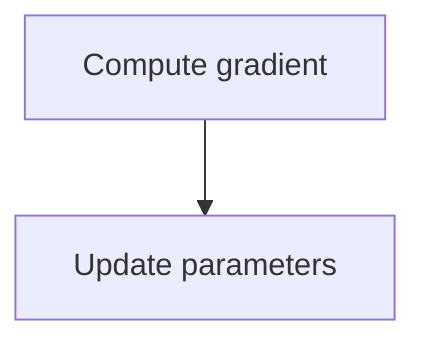
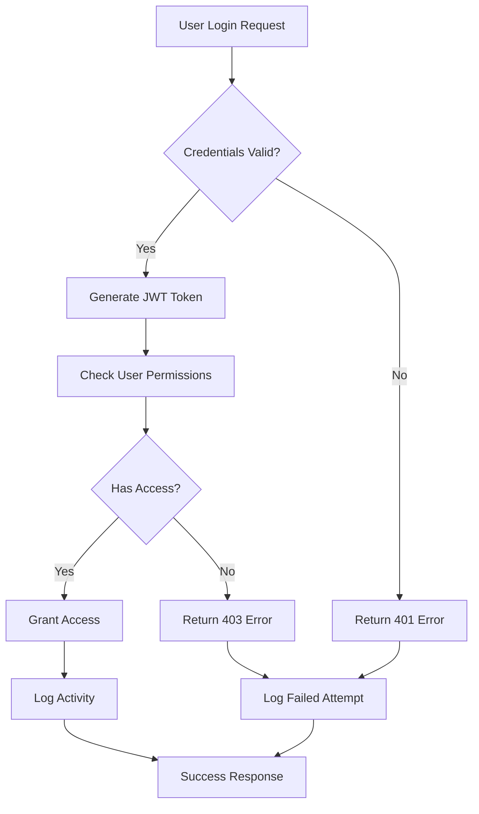
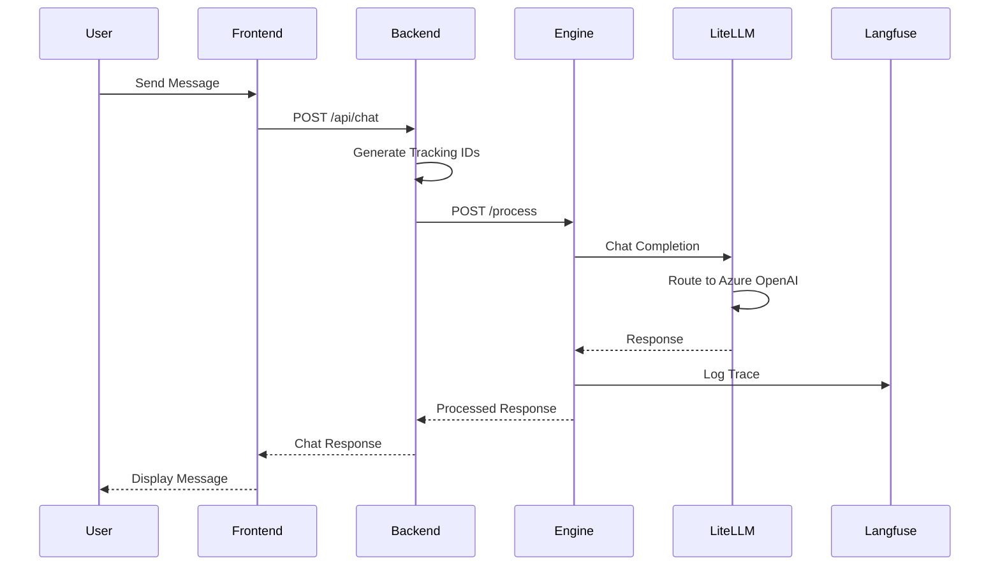
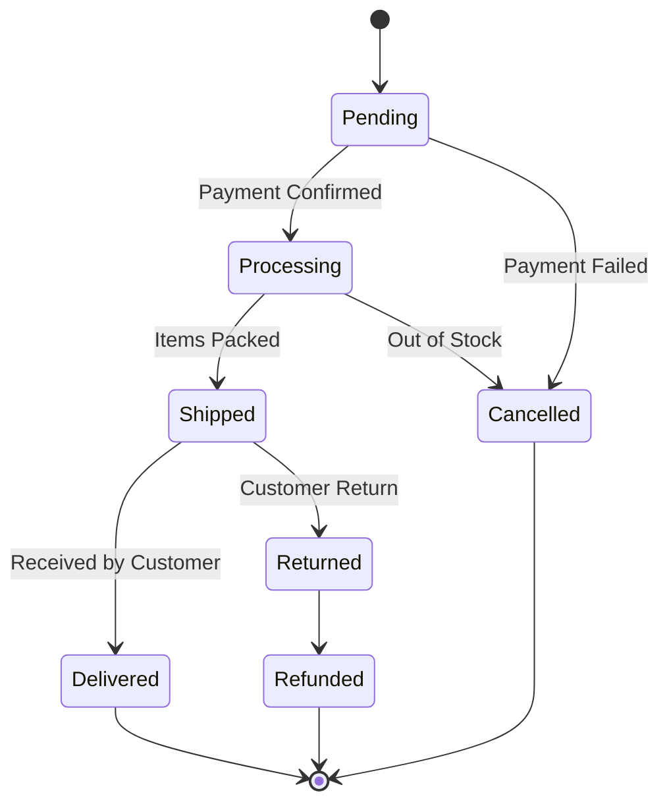
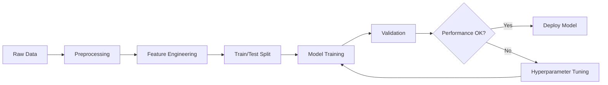
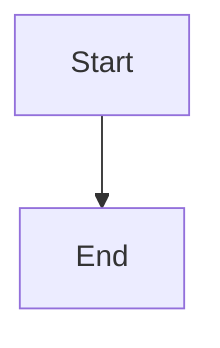

# Rich Content Rendering Guide

This document describes all supported rich content rendering features in the chat UI and how to format LLM responses to take advantage of them.

## ✨ Feature Highlights (v2.0)

| Feature | Capability | Interactive |
|---------|------------|-------------|
| **Tables** | Markdown tables | ✅ Sortable + Paginated (10/page) |
| **Code** | 180+ languages | ✅ Custom color scheme |
| **Math** | LaTeX equations | Display + Inline |
| **Diagrams** | Mermaid (8+ types) | ✅ Enhanced errors |
| **Charts** | Plotly (15+ types) | ✅ Interactive visualizations |
| **UI/UX** | Fixed layout | ✅ No jumping input |

## Table of Contents

1. [Markdown Basics](#markdown-basics)
2. [Tables](#tables) - 🆕 **Sortable & Paginated**
3. [Code Syntax Highlighting](#code-syntax-highlighting) - 🆕 **Custom Colors**
4. [LaTeX Math Equations](#latex-math-equations)
5. [Mermaid Diagrams](#mermaid-diagrams) - 🆕 **Better Error Handling**
6. [Plotly Charts](#plotly-charts)
7. [Combining Features](#combining-features)
8. [Best Practices](#best-practices)
9. [UI/UX Improvements](#uiux-improvements) - 🆕 **Fixed Input Area**

---

## Markdown Basics

The UI supports GitHub Flavored Markdown (GFM) for rich text formatting.

### Supported Features

- **Headings**: `# H1`, `## H2`, `### H3`, `#### H4`
- **Bold**: `**bold text**` or `__bold text__`
- **Italic**: `*italic text*` or `_italic text_`
- **Bold + Italic**: `***bold and italic***`
- **Strikethrough**: `~~strikethrough~~`
- **Links**: `[link text](https://example.com)`
- **Inline code**: `` `code` ``
- **Blockquotes**: `> quote text`
- **Lists**: Ordered (`1. item`) and unordered (`- item` or `* item`)
- **Horizontal rules**: `---` or `***`
- **Task lists**: `- [ ] unchecked` and `- [x] checked`

### Example LLM Response

**LLM Output:**
```markdown
Here's a summary of the analysis:

## Key Findings

**Important**: The data shows a **significant increase** in user engagement.

### Details

1. User growth: *25% increase* month-over-month
2. Engagement metrics:
   - Session duration: **up 15%**
   - Pages per session: **up 20%**
3. ~~Old target~~ New target: 100K users

> "This represents our best quarter to date" - CEO

Visit [our dashboard](https://example.com) for more details.

**Action Items:**
- [ ] Review marketing budget
- [x] Update projections
- [ ] Schedule team meeting
```

**Renders as:**
> Properly formatted markdown with headings, bold, italic, lists, blockquotes, links, and task lists all styled correctly.

---

## Tables

Tables use GitHub Flavored Markdown syntax with **interactive sorting and automatic pagination**.

### ✨ Interactive Features

**All tables are automatically enhanced with:**
- **Sortable Columns**: Click any column header to sort (ascending → descending → reset)
- **Smart Sorting**: Automatically detects numbers, text, dates, and mixed content
- **Pagination**: Tables with >10 rows automatically paginate (10 rows per page)
- **Navigation**: Previous/Next buttons and page number controls
- **Row Counter**: Shows "Showing 1-10 of 45 rows"

### Syntax

```markdown
| Column 1 | Column 2 | Column 3 |
|----------|----------|----------|
| Row 1    | Data     | More     |
| Row 2    | Data     | More     |
```

### Alignment

```markdown
| Left Aligned | Center Aligned | Right Aligned |
|:-------------|:--------------:|--------------:|
| Text         | Text           | Text          |
```

### Sorting Behavior

- **Text columns**: Alphabetical sorting (case-insensitive)
- **Numeric columns**: Numerical sorting (e.g., 2 comes before 10)
- **Mixed columns**: Natural sorting (intelligent number detection)
- **Date columns**: Works if formatted consistently
- **Sort indicators**: ↑ (ascending), ↓ (descending), ↕ (unsorted)

### Pagination Details

- **Threshold**: >10 rows triggers pagination
- **Page size**: 10 rows per page (default)
- **Maximum**: Supports up to 100 rows comfortably
- **Controls**: Previous/Next buttons + page numbers (1 2 3 ... 10)
- **Smart display**: Shows pages around current (e.g., 1 ... 4 5 6 ... 10)
- **Sort integration**: Sorting resets to page 1 automatically

### Example LLM Response

**LLM Output:**
```markdown
Here's a comparison of the top programming languages:

| Language   | Released | Typing     | Performance | Use Case           |
|------------|----------|------------|-------------|--------------------|
| Python     | 1991     | Dynamic    | Moderate    | Data Science, AI   |
| JavaScript | 1995     | Dynamic    | Fast        | Web Development    |
| Java       | 1995     | Static     | Fast        | Enterprise Apps    |
| Go         | 2009     | Static     | Very Fast   | Cloud Services     |
| Rust       | 2010     | Static     | Very Fast   | Systems Programming|

**Key Observations:**
- Newer languages focus on performance and safety
- Static typing is prevalent in high-performance languages
- Each language has a dominant use case
```

**Renders as:**
> A fully interactive table with:
> - ✅ **Sortable columns** - Click "Released" to sort by year, "Language" for alphabetical
> - ✅ **Sort indicators** - Each header shows ↕ (click to sort)
> - ✅ **Hover effects** - Headers highlight on hover, active sort column has blue background
> - ✅ **Smart sorting** - "Released" sorts numerically (1991 < 1995 < 2009)
> - ✅ **Styled beautifully** - Clean borders, subtle shadows, responsive design

### Large Table Example (with Pagination)

**LLM Output:**
```markdown
Top 50 programming languages by popularity:

| Rank | Language   | Score | Change | Primary Use      |
|------|------------|-------|--------|------------------|
| 1    | Python     | 100   | +2     | AI/Data Science  |
| 2    | JavaScript | 98    | 0      | Web Development  |
| 3    | Java       | 92    | -1     | Enterprise       |
| 4    | C++        | 88    | +1     | Systems          |
| 5    | C#         | 85    | 0      | Applications     |
...
| 50   | Lua        | 12    | -2     | Gaming/Embedded  |
```

**Renders with:**
- ✅ **Automatic pagination** - Shows rows 1-10 by default
- ✅ **Navigation controls** - "Previous" | 1 2 3 4 5 | "Next" buttons
- ✅ **Row counter** - "Showing 1-10 of 50 rows"
- ✅ **Page indicators** - Active page highlighted in blue
- ✅ **Sorting across pages** - Sort by any column, pagination adjusts
- ✅ **Smart page display** - For many pages: 1 ... 3 4 5 ... 10

---

## Code Syntax Highlighting

Code blocks support syntax highlighting for 180+ languages with a **custom color scheme** that matches the UI design.

### Syntax

````markdown
```language
code here
```
````

### Custom Color Scheme

**Optimized for readability** against dark background (#0d1117):

| Element | Color | Example |
|---------|-------|---------|
| Keywords | **#3498db** (UI blue, bold) | `def`, `for`, `import`, `return`, `if` |
| Functions | **#48c9b0** (bright cyan) | `print()`, `len()`, `range()` |
| Variables | **#ffffff** (bright white) | `x`, `y`, `result`, `count` |
| Strings | **#f39c12** (warm orange) | `"text"`, `'string'` |
| Numbers | **#2ecc71** (light green) | `42`, `3.14`, `0xFF` |
| Comments | **#95a5a6** (gray, italic) | `# comment`, `// comment` |
| Operators | **#1abc9c** (cyan) | `+`, `-`, `*`, `=`, `==` |
| Special values | **#e74c3c** (red) | `None`, `True`, `False`, `null` |

**All syntax elements have high contrast** for maximum readability.

### Supported Languages

Common languages: `python`, `javascript`, `typescript`, `java`, `cpp`, `go`, `rust`, `sql`, `bash`, `json`, `yaml`, `markdown`, `html`, `css`, etc.

### Example LLM Response

**LLM Output:**
````markdown
Here's a Python function to calculate Fibonacci numbers:

```python
def fibonacci(n: int) -> list[int]:
    """
    Generate Fibonacci sequence up to n terms.

    Args:
        n: Number of terms to generate

    Returns:
        List of Fibonacci numbers
    """
    if n <= 0:
        return []
    elif n == 1:
        return [0]

    fib = [0, 1]
    for i in range(2, n):
        fib.append(fib[i-1] + fib[i-2])

    return fib

# Example usage
result = fibonacci(10)
print(f"First 10 Fibonacci numbers: {result}")
```

**Time Complexity:** O(n)
**Space Complexity:** O(n)
````

**Renders as:**
> Code block with:
> - ✅ **Dark background** - #0d1117 for reduced eye strain
> - ✅ **Custom syntax highlighting** - UI-matched colors (#3498db blue theme)
> - ✅ **High contrast** - All elements clearly visible (white variables, cyan functions, orange strings)
> - ✅ **Proper indentation** - Formatting preserved exactly
> - ✅ **Monospace font** - Monaco, Menlo, Consolas family
> - ✅ **Horizontal scrolling** - For long lines without breaking
> - Copy button (reserved space in UI)

### Inline Code

**LLM Output:**
```markdown
Use the `fibonacci()` function with `n=10` to get the first 10 numbers.
```

**Renders as:**
> Inline code with pink/red color (#c7254e) on light gray background

---

## LaTeX Math Equations

Support for mathematical equations using KaTeX rendering engine.

### Syntax

- **Inline math**: `$equation$`
- **Display math (centered)**: `$$equation$$` or on separate lines

### Example LLM Response

**LLM Output:**
```markdown
The quadratic formula solves equations of the form $ax^2 + bx + c = 0$:

$$
x = \frac{-b \pm \sqrt{b^2 - 4ac}}{2a}
$$

**Key Components:**
- $a$ is the coefficient of $x^2$ (cannot be zero)
- $b$ is the coefficient of $x$
- $c$ is the constant term
- The discriminant $\Delta = b^2 - 4ac$ determines the number of solutions:
  - If $\Delta > 0$: Two real solutions
  - If $\Delta = 0$: One real solution
  - If $\Delta < 0$: Two complex solutions

**Example:** For $2x^2 - 5x + 2 = 0$:

$$
x = \frac{5 \pm \sqrt{25 - 16}}{4} = \frac{5 \pm 3}{4}
$$

Therefore: $x_1 = 2$ and $x_2 = 0.5$
```

**Renders as:**
> - Inline equations: Properly sized and styled within text
> - Display equations: Centered, larger, with proper spacing
> - All mathematical symbols, Greek letters, fractions, radicals, etc. rendered beautifully
> - Supports complex expressions: matrices, integrals, summations, limits, etc.

### Common Math Symbols

```markdown
- Greek letters: $\alpha, \beta, \gamma, \Delta, \Sigma$
- Operators: $\times, \div, \pm, \leq, \geq, \neq, \approx$
- Calculus: $\int, \frac{dy}{dx}, \sum_{i=1}^{n}, \lim_{x \to \infty}$
- Matrices: $\begin{bmatrix} a & b \\ c & d \end{bmatrix}$
```

---

## Mermaid Diagrams

Interactive diagrams for flowcharts, sequence diagrams, and more.

### Syntax

````markdown
```mermaid
diagram code here
```
````

### Supported Diagram Types

1. **Flowcharts** (`graph` or `flowchart`)
2. **Sequence Diagrams** (`sequenceDiagram`)
3. **Class Diagrams** (`classDiagram`)
4. **State Diagrams** (`stateDiagram-v2`)
5. **Entity Relationship** (`erDiagram`)
6. **Gantt Charts** (`gantt`)
7. **Pie Charts** (`pie`)
8. **Git Graphs** (`gitGraph`)

### 🚨 Critical Rules

**NEVER use Unicode mathematical symbols in Mermaid diagrams:**

❌ **WRONG** (causes parse errors):
```mermaid
graph TD
    A[Compute ∇J(θ)] --> B[Update θ ← θ - η∇J(θ)]
```

✅ **CORRECT** (use plain English):


**Why?** Mermaid's parser cannot handle Unicode symbols (∇, θ, α, β, η, ←, →, Σ, etc.) in node labels. Use mathematical symbols **only in LaTeX blocks** (`$...$` or `$$...$$`), never in diagrams.

### Error Handling

If a Mermaid diagram fails to render:
- ✅ **Enhanced error display** shows:
  - Clear error message with line number
  - Expandable "Show diagram code" section
  - Helps identify syntax issues quickly
- ✅ **Common fixes**:
  - Remove Unicode symbols from labels
  - Use `graph TD` or `graph LR` (not just `graph`)
  - Escape special characters: `A["Text with (parens)"]`
  - Use simple alphanumeric node IDs: `A`, `B`, `C1`, `Start`

### Example LLM Responses

#### Flowchart

**LLM Output:**
````markdown
Here's the user authentication flow:



**Process Steps:**
1. Validate credentials
2. Generate authentication token
3. Check permissions
4. Log all activities
````

**Renders as:**
> - Interactive flowchart with nodes, arrows, and decision diamonds
> - Clean white background with shadow
> - Readable text and clear connections
> - SVG format (scalable)

#### Sequence Diagram

**LLM Output:**
````markdown
Here's how the chat application processes messages:


````

**Renders as:**
> - Vertical timeline showing message flow
> - Participants shown as boxes at top
> - Solid arrows for requests, dashed for responses
> - Clear sequence of events

#### State Diagram

**LLM Output:**
````markdown
Order processing states:


````

**Renders as:**
> - State transition diagram
> - Clear states and transitions
> - Start and end states marked

---

## Plotly Charts

Interactive data visualizations using Plotly.js.

### Syntax

````markdown
```plotly
{
  "data": [...],
  "layout": {...},
  "config": {...}
}
```
````

### Chart Structure

```json
{
  "data": [
    {
      "x": [...],
      "y": [...],
      "type": "chart_type",
      "name": "series_name",
      ...
    }
  ],
  "layout": {
    "title": "Chart Title",
    "xaxis": {"title": "X Label"},
    "yaxis": {"title": "Y Label"}
  }
}
```

### Common Chart Types

- `scatter` - Line/scatter plots
- `bar` - Bar charts
- `pie` - Pie charts
- `histogram` - Histograms
- `box` - Box plots
- `heatmap` - Heatmaps
- `scatter3d` - 3D scatter plots
- `surface` - 3D surface plots

### Example LLM Responses

#### Bar Chart

**LLM Output:**
````markdown
Here's the quarterly revenue breakdown:

```plotly
{
  "data": [{
    "x": ["Q1 2024", "Q2 2024", "Q3 2024", "Q4 2024"],
    "y": [145000, 178000, 162000, 195000],
    "type": "bar",
    "marker": {
      "color": ["#3498db", "#2ecc71", "#f39c12", "#e74c3c"]
    },
    "text": ["$145K", "$178K", "$162K", "$195K"],
    "textposition": "outside"
  }],
  "layout": {
    "title": "Quarterly Revenue - 2024",
    "xaxis": {"title": "Quarter"},
    "yaxis": {"title": "Revenue ($)"},
    "showlegend": false
  }
}
```

**Key Insights:**
- Total annual revenue: $680,000
- Best quarter: Q4 with $195,000 (28.7%)
- Average per quarter: $170,000
- Growth: 34.5% from Q1 to Q4
````

**Renders as:**
> - Interactive bar chart with hover tooltips
> - Custom colors for each bar
> - Labels showing exact values
> - Zoom, pan, and export controls
> - Professional styling with white background

#### Line Chart (Multi-Series)

**LLM Output:**
````markdown
Product performance comparison over 6 months:

```plotly
{
  "data": [
    {
      "x": ["Jan", "Feb", "Mar", "Apr", "May", "Jun"],
      "y": [45, 52, 48, 61, 58, 67],
      "type": "scatter",
      "mode": "lines+markers",
      "name": "Product A",
      "line": {"color": "#3498db", "width": 3},
      "marker": {"size": 8}
    },
    {
      "x": ["Jan", "Feb", "Mar", "Apr", "May", "Jun"],
      "y": [38, 42, 55, 59, 62, 71],
      "type": "scatter",
      "mode": "lines+markers",
      "name": "Product B",
      "line": {"color": "#2ecc71", "width": 3},
      "marker": {"size": 8}
    },
    {
      "x": ["Jan", "Feb", "Mar", "Apr", "May", "Jun"],
      "y": [30, 35, 38, 42, 48, 53],
      "type": "scatter",
      "mode": "lines+markers",
      "name": "Product C",
      "line": {"color": "#f39c12", "width": 3},
      "marker": {"size": 8}
    }
  ],
  "layout": {
    "title": "Monthly Sales by Product",
    "xaxis": {"title": "Month"},
    "yaxis": {"title": "Sales (Units)"},
    "hovermode": "x unified",
    "legend": {"x": 0, "y": 1}
  }
}
```

**Analysis:**
- **Product B**: Strongest growth (87% increase)
- **Product A**: Steady performance with peaks
- **Product C**: Consistent but slower growth
````

**Renders as:**
> - Multi-line chart with different colors
> - Legend showing all series
> - Interactive hover showing all values at once
> - Smooth lines with visible markers
> - Full Plotly controls (zoom, pan, download)

#### Pie Chart

**LLM Output:**
````markdown
Market share distribution:

```plotly
{
  "data": [{
    "labels": ["Company A", "Company B", "Company C", "Company D", "Others"],
    "values": [35, 28, 18, 12, 7],
    "type": "pie",
    "hole": 0.3,
    "marker": {
      "colors": ["#3498db", "#2ecc71", "#f39c12", "#e74c3c", "#95a5a6"]
    },
    "textinfo": "label+percent",
    "textposition": "outside"
  }],
  "layout": {
    "title": "2024 Market Share"
  }
}
```
````

**Renders as:**
> - Donut chart (with hole in center)
> - Custom colors
> - Labels and percentages outside slices
> - Interactive hover with details
> - Click to highlight/hide slices

---

## Combining Features

You can combine multiple rich content features in a single response.

### Example: Comprehensive Analysis

**LLM Output:**
````markdown
# Machine Learning Model Performance Analysis

## Overview

I've analyzed the performance of our three ML models. Here are the results:

### Model Comparison Table

| Model          | Accuracy | Precision | Recall | F1-Score | Training Time |
|----------------|----------|-----------|--------|----------|---------------|
| Random Forest  | 94.2%    | 92.8%     | 95.1%  | 93.9%    | 45 min        |
| Neural Network | 96.5%    | 95.2%     | 97.3%  | 96.2%    | 2.3 hrs       |
| XGBoost        | 95.8%    | 94.5%     | 96.7%  | 95.6%    | 1.1 hrs       |

### Performance Visualization

```plotly
{
  "data": [
    {
      "x": ["Random Forest", "Neural Network", "XGBoost"],
      "y": [94.2, 96.5, 95.8],
      "type": "bar",
      "name": "Accuracy",
      "marker": {"color": "#3498db"}
    },
    {
      "x": ["Random Forest", "Neural Network", "XGBoost"],
      "y": [93.9, 96.2, 95.6],
      "type": "bar",
      "name": "F1-Score",
      "marker": {"color": "#2ecc71"}
    }
  ],
  "layout": {
    "title": "Model Performance Comparison",
    "yaxis": {"title": "Score (%)"},
    "barmode": "group"
  }
}
```

### Mathematical Foundation

The F1-Score is calculated using the harmonic mean of precision and recall:

$$
F_1 = 2 \cdot \frac{\text{precision} \cdot \text{recall}}{\text{precision} + \text{recall}}
$$

Where:
- $\text{precision} = \frac{TP}{TP + FP}$
- $\text{recall} = \frac{TP}{TP + FN}$

### Training Pipeline



### Implementation Code

```python
from sklearn.ensemble import RandomForestClassifier
from sklearn.metrics import f1_score

# Train the model
model = RandomForestClassifier(
    n_estimators=100,
    max_depth=10,
    random_state=42
)
model.fit(X_train, y_train)

# Evaluate
y_pred = model.predict(X_test)
f1 = f1_score(y_test, y_pred, average='weighted')
print(f"F1-Score: {f1:.2%}")
```

## Recommendations

Based on the analysis:

1. **Best Overall**: Neural Network
   - Highest accuracy and F1-score
   - Worth the extra training time

2. **Best Speed/Performance**: XGBoost
   - 2x faster than Neural Network
   - Only 0.7% lower accuracy

3. **Most Balanced**: Random Forest
   - Fastest training
   - Good performance
   - Easiest to interpret

> **Note**: Consider using ensemble methods to combine all three models for even better performance.
````

**Renders as:**
> A rich, multi-format response with:
> - Formatted headings and text
> - Professional table with metrics
> - Interactive bar chart
> - Mathematical equations
> - Process flowchart
> - Syntax-highlighted code
> - Styled recommendations with blockquote

---

## Best Practices

### 1. Structure Your Response

**Good:**
```markdown
# Main Topic

Brief introduction...

## Section 1

Content with examples...

## Section 2

More content...

## Summary

Key takeaways...
```

### 2. Use Appropriate Visualizations

- **Tables**: For structured data comparison - **Now sortable and paginated!**
  - ✅ Best for: Rankings, datasets, comparisons (up to 100 rows)
  - ✅ Users can sort by any column
  - ✅ Auto-pagination for readability
- **Charts**: For trends, distributions, and relationships
  - ✅ Interactive Plotly visualizations
  - ✅ Hover tooltips and zoom
- **Diagrams**: For processes, flows, and architectures
  - ⚠️ **Never use math symbols** (∇, θ, α) in Mermaid - use plain English
  - ✅ Use LaTeX for equations instead
- **Math**: For formulas and equations
  - ✅ LaTeX inline (`$...$`) or display (`$$...$$`)
- **Code**: For implementations and examples
  - ✅ Custom color scheme for maximum readability

### 3. Add Context

Don't just show charts/diagrams - explain them:

```markdown
Here's the revenue trend:

[chart]

**Key Insights:**
- Revenue increased 25% year-over-year
- Q3 showed the highest growth
- Seasonal patterns are evident
```

### 4. Validate Data Before Charting

```python
# Engine code
if not data or len(data) < 2:
    return "Insufficient data for visualization"

if len(x) != len(y):
    return "Data arrays must have same length"
```

### 5. Keep Visualizations Focused

**Charts:**
- **Max data points**: 10,000 for performance
- **Max series**: 5-7 for readability
- **Clear labels**: Always include titles and axis labels

**Tables:**
- **Optimal size**: 10-50 rows (auto-paginated at 10)
- **Maximum**: 100 rows (still performant with pagination)
- **Column count**: 3-8 columns for readability
- **Clear headers**: Descriptive names (users will click to sort!)
- **Data types**: Numbers sort numerically, text alphabetically

### 6. Use Templates When Available

```python
# In engine code
from app.utils.chart_formatter import PlotlyTemplates

# Simple and clean
chart = PlotlyTemplates.bar_chart(categories, values, title)
```

### 7. Test Complex Responses

Before deploying, test responses with:
- Multiple features combined
- Edge cases (empty data, special characters)
- Long content (scrolling behavior)
- Mobile/responsive rendering

### 8. Leverage Interactive Features

**For Tables:**
```markdown
| Rank | Language | Score | Change |
|------|----------|-------|--------|
| 1    | Python   | 100   | +2     |
| 2    | JavaScript | 98  | 0      |

💡 **Tip**: Click column headers to sort by Rank, Language, Score, or Change!
```

**For Diagrams:**
```markdown
❌ Avoid: A[Compute ∇J(θ)]
✅ Better: A[Compute gradient]

Then use LaTeX for math: The gradient $\nabla J(\theta)$ is computed as...
```

### 9. Handle Errors Gracefully

```python
try:
    chart = format_plotly_chart(data, layout)
except Exception as e:
    logger.error(f"Chart generation failed: {e}")
    chart = "Chart data unavailable"
```

### 10. Format Code Properly

- Use appropriate language tags for syntax highlighting
- Include comments in code examples
- Keep code examples concise but complete
- Add explanations after code blocks

### 11. Balance Rich Content

Don't overuse features - use them purposefully:

**Too Much:**
```markdown
[giant table]
[5 charts]
[10 equations]
[3 diagrams]
[code blocks]
```

**Balanced:**
```markdown
Summary paragraph
[relevant table]
Key insight
[focused chart]
Explanation
[short code example]
```

---

## Common Pitfalls

### 1. Invalid JSON in Plotly Blocks

**Wrong:**
````markdown
```plotly
{
  "data": [{
    "x": [1, 2, 3],
    "y": [4, 5, 6]  // Comments not allowed in JSON!
  }]
}
```
````

**Correct:**
````markdown
```plotly
{
  "data": [{
    "x": [1, 2, 3],
    "y": [4, 5, 6]
  }]
}
```
````

### 2. Broken Mermaid Syntax

**Wrong:**
````markdown
```mermaid
graph TD
    A[Start] -> B[End]  // Wrong arrow syntax
```
````

**Correct:**
````markdown

````

### 3. Unmatched LaTeX Delimiters

**Wrong:**
```markdown
The formula is $x^2 + y^2  (missing closing $)
```

**Correct:**
```markdown
The formula is $x^2 + y^2$
```

### 4. Malformed Tables

**Wrong:**
```markdown
| Header 1 | Header 2
| Data 1 | Data 2 |  // Missing separator row
```

**Correct:**
```markdown
| Header 1 | Header 2 |
|----------|----------|
| Data 1   | Data 2   |
```

### 5. Missing Language Tags

**Wrong:**
````markdown
```
def hello():
    print("Hello")
```
````

**Correct:**
````markdown
```python
def hello():
    print("Hello")
```
````

---

## Performance Considerations

### Bundle Sizes

- **Plotly.js**: ~6MB (1.8MB gzipped)
- **Mermaid**: ~2MB (included in chunks)
- **KaTeX**: ~600KB (fonts + CSS)
- **Highlight.js**: ~500KB (with all languages)

**Total**: ~9MB initial load, cached by browser

### Optimization Tips

1. **Limit data points**: Keep charts under 10K points
2. **Lazy load**: Charts render on scroll into view
3. **Debounce updates**: Don't re-render on every keystroke
4. **Cache**: Browser caches all libraries
5. **Code splitting**: Features load on demand

---

## Quick Reference

### Markdown Syntax

| Feature | Syntax |
|---------|--------|
| Heading | `# H1`, `## H2`, `### H3` |
| Bold | `**text**` |
| Italic | `*text*` |
| Code | `` `code` `` |
| Link | `[text](url)` |
| List | `- item` or `1. item` |
| Blockquote | `> text` |
| Table | `\| Col1 \| Col2 \|` |

### LaTeX Math

| Element | Syntax |
|---------|--------|
| Inline | `$x^2$` |
| Display | `$$x^2$$` |
| Fraction | `\frac{a}{b}` |
| Square root | `\sqrt{x}` |
| Superscript | `x^2` |
| Subscript | `x_i` |
| Sum | `\sum_{i=1}^{n}` |
| Integral | `\int_a^b` |

### Code Languages

Common: `python`, `javascript`, `typescript`, `java`, `cpp`, `go`, `rust`, `sql`, `bash`, `json`, `yaml`, `html`, `css`

### Mermaid Types

- `graph TD` - Flowchart (top-down)
- `sequenceDiagram` - Sequence
- `classDiagram` - Class
- `stateDiagram-v2` - State
- `erDiagram` - ER diagram
- `gantt` - Gantt chart

### Plotly Types

- `scatter` - Line/scatter
- `bar` - Bar chart
- `pie` - Pie chart
- `histogram` - Histogram
- `box` - Box plot
- `heatmap` - Heatmap

---

## Support and Troubleshooting

### If Charts Don't Render

1. Check browser console for errors
2. Validate JSON syntax (use JSON linter)
3. Ensure data arrays are not empty
4. Check that required fields are present

### If Diagrams Don't Render

1. Check browser console for errors
2. Validate mermaid syntax at [mermaid.live](https://mermaid.live)
3. Ensure proper indentation
4. Use correct diagram type

### If Math Doesn't Render

1. Check for unmatched `$` delimiters
2. Escape special characters if needed
3. Use `\\` for LaTeX commands
4. Check KaTeX supported functions

### If Code Highlighting Doesn't Work

1. Ensure language tag is correct
2. Check for proper code block fences (```)
3. Verify language is supported by highlight.js

---

## UI/UX Improvements

### Fixed Input Area
- ✅ **Always visible** - Input box stays fixed at the bottom of the screen
- ✅ **Never moves** - Remains in place regardless of message count
- ✅ **Smart scrolling** - Only the message area scrolls, not the entire page
- ✅ **Proper layout** - Header fixed at top, messages scrollable in middle, input fixed at bottom

### Auto-Scroll Behavior
- ✅ **Smooth scrolling** - New messages automatically scroll into view
- ✅ **Container-only** - Scrolls within message list, not entire viewport
- ✅ **No layout shift** - Input area never jumps or moves

### Responsive Design
- ✅ **Flexible layout** - Adapts to different screen sizes
- ✅ **Touch-friendly** - Works well on tablets and mobile
- ✅ **Overflow handling** - Long content scrolls properly

---

## Version History

- **v2.0** (2026-01-01): Major feature update
  - ✨ **Interactive sortable tables** - Click column headers to sort
  - ✨ **Automatic pagination** - Tables >10 rows paginate (10/page)
  - ✨ **Custom syntax highlighting** - UI-matched color scheme (#3498db theme)
  - ✨ **Enhanced Mermaid error handling** - Better error messages and debugging
  - ✨ **Fixed input area** - No more jumping/moving input box
  - ✨ **Improved auto-scroll** - Container-only scrolling
  - 🐛 **Fixed**: Mathematical symbols no longer allowed in Mermaid diagrams

- **v1.0** (2026-01-01): Initial release
  - Markdown (GFM)
  - Tables (basic)
  - Code syntax highlighting (180+ languages)
  - LaTeX math equations
  - Mermaid diagrams (8+ types)
  - Plotly charts (15+ types)

---

## Related Documentation

- [Chart Support Guide](./CHART_SUPPORT.md) - Detailed Plotly chart examples
- [Tracking and Observability](./TRACKING_AND_OBSERVABILITY.md) - System monitoring

---

**Note**: All features are production-ready and have been tested across major browsers (Chrome, Firefox, Safari, Edge).
